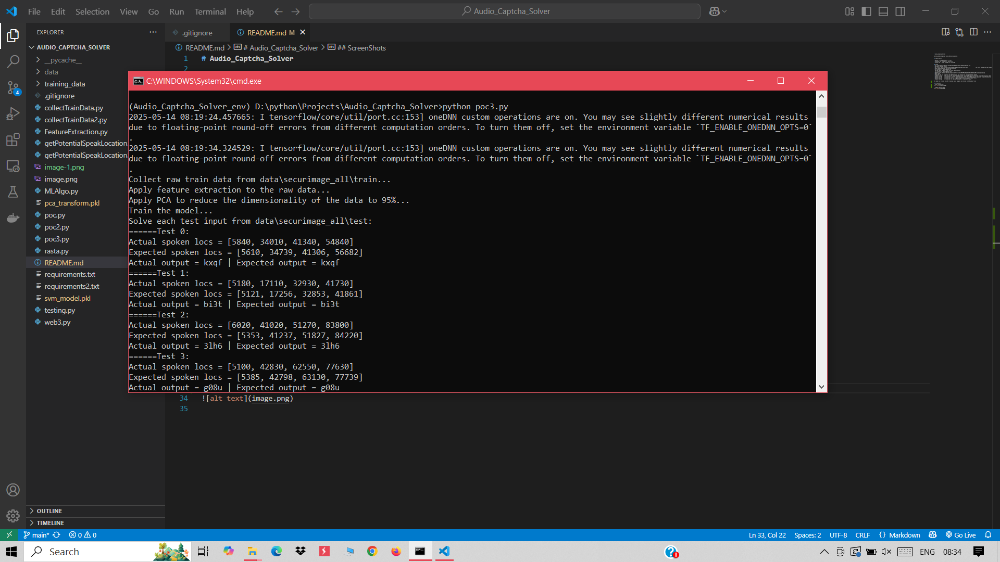
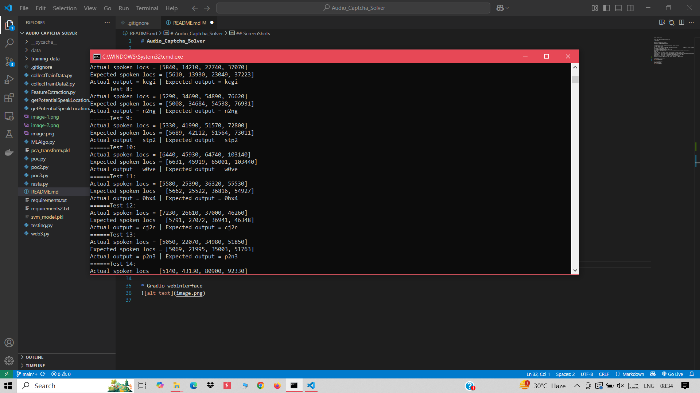
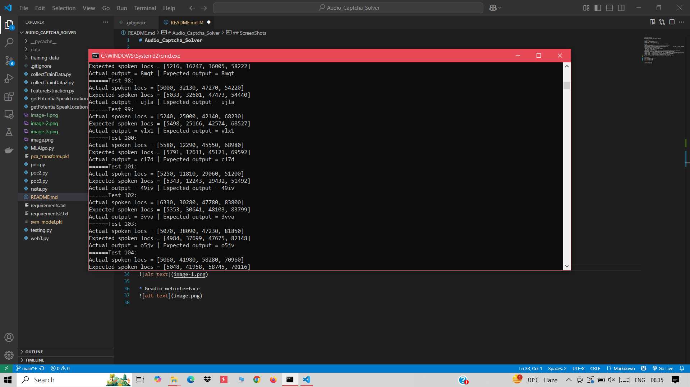
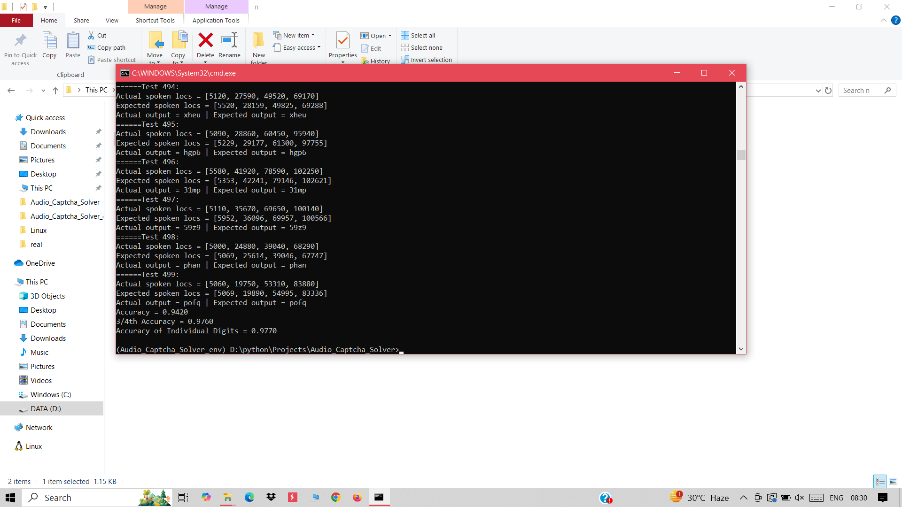
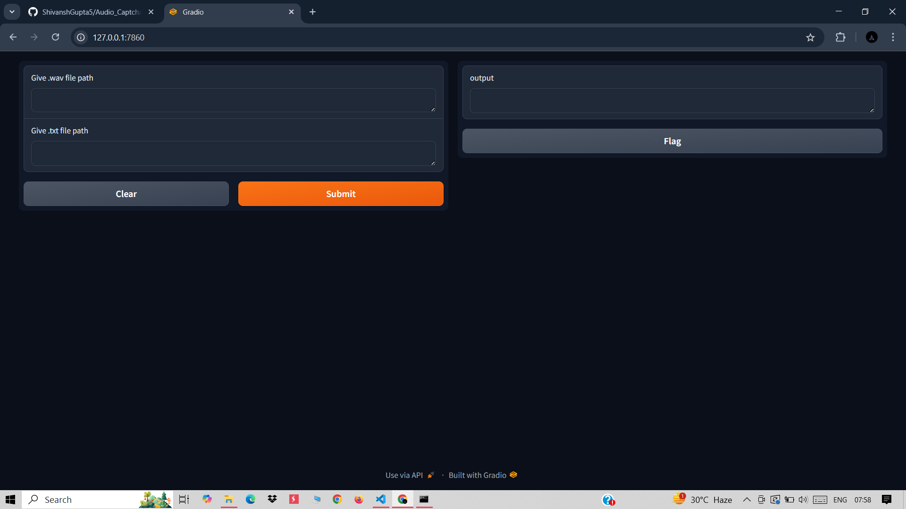

# Audio_Captcha_Solver

Solving Audio Captchas using Machine Learning

## Requirements

* python >= 3.6(preferably 3.9.11)
* Disablle any firewall or antivirus
* Atleast 10 - 12 GB of RAM for training

## Setup
* git clone https://github.com/ShivanshGupta5/Audio_Captcha_Solver.git
* cd Audio_Captcha_Solver
* py -3.9 -m venv --system-site-packages Audio_Captcha_Solver_env               (In place of 3.9 use the python version you want to use)
* Audio_Captcha_Solver_env\Scripts\activate
* pip install -r requirements.txt
  If the above command gives an error then run this
  pip install -r requirements2.txt
* Dataset Link: https://drive.google.com/file/d/1e-yN5CbP0jmDpqQAnIqELxJDxOzGuoPG/view?usp=sharing
* mkdir data
* Download the zip file from the Dataset link and extract it inside the data folder
* python poc3.py    (If you want to save the model after training(Accuracy about 97%))
* gradio web3.py    (If you want to deploy the model on a web interface)

The model is trained on 1000 training audio samples and tested on 500 audio files

## ScreenShots
* Model Training and Evaluation:

* Gradio webinterface

